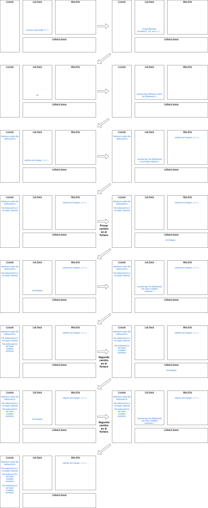

# Práctica 10 - Aplicación de registro de Funko Pops
#### Realizado por: Juan Carlos Rey Medina (alu0101410869)

[](https://github.com/ULL-ESIT-INF-DSI-2223/ull-esit-inf-dsi-22-23-prct10-fs-proc-sockets-funko-app-JuanCarlosRey/actions/workflows/tests.yml) [](https://github.com/ULL-ESIT-INF-DSI-2223/ull-esit-inf-dsi-22-23-prct10-fs-proc-sockets-funko-app-JuanCarlosRey/actions/workflows/coveralls.yml) [](https://coveralls.io/github/ULL-ESIT-INF-DSI-2223/ull-esit-inf-dsi-22-23-prct10-fs-proc-sockets-funko-app-JuanCarlosRey?branch=main) [](https://github.com/ULL-ESIT-INF-DSI-2223/ull-esit-inf-dsi-22-23-prct10-fs-proc-sockets-funko-app-JuanCarlosRey/actions/workflows/sonar.yml) [](https://sonarcloud.io/summary/new_code?id=ULL-ESIT-INF-DSI-2223_ull-esit-inf-dsi-22-23-prct10-fs-proc-sockets-funko-app-JuanCarlosRey)

## Introducción
En esta décima práctica de la asignatura se nos ha pedido realizar una serie de ejercicios en los que se trabaja el uso de las APIs asíncronas de gestión del sistema de ficheros (módulo ```fs```), de creación de procesos (módulo ```child_process```) y de creación de sockets (módulo ```net```) de **Node.js**.

## Pasos previos
Antes de realizar los ejercicios solicitado, primero se ha realizado una serie de pasos previos a modo de preparación para la práctica:
- Realizar la [configuración incial del proyecto TypeScript](https://ull-esit-inf-dsi-2223.github.io/typescript-theory/typescript-project-setup.html).
- Instalar [Typedoc](https://typedoc.org) para la generación de documentación.
- Instalar [Mocha](https://mochajs.org) y [Chai](https://www.chaijs.com) para la realización de tests unitarios.
- Instalar [Istanbul](https://istanbul.js.org) y [Coveralls](https://coveralls.io) para el cubrimiento del código.
- Activar las [**GitHub Actions**](https://docs.github.com/en/actions) tanto para las [pruebas](https://drive.google.com/file/d/1hwtPovQlGvthaE7e7yYshC4v8rOtLSw0/view?usp=sharing) como para el [cubrimiento](https://drive.google.com/file/d/1yOonmpVbOyvzx3ZbXMQTAPxvA3a7AE7w/view?usp=sharing) y la calidad de códgio ([Sonar Cloud](https://sonarcloud.io/projects)).
- Instalar los paquetes [Chalk](https://www.npmjs.com/package/chalk) para imprimir en color, [Yargs](https://www.npmjs.com/package/yargs) para ejecutar la app mediante comandos y parámetros, y la [API sincrona de Node.js](https://nodejs.org/docs/latest-v19.x/api/fs.html) para la persistencia de los datos de la app.
- Leer los [apuntes de la asignatura](https://ull-esit-inf-dsi-2223.github.io/nodejs-theory/) relacionados con la creación de ficheros y sockets.

## Ejercicios
### Ejercicio 1
En este ejercicios se nos pide realizar una traza sobre el comportamiento del siguiente código fuente TypeScript:

```ts
import {access, constants, watch} from 'fs';

if (process.argv.length !== 3) {
  console.log('Please, specify a file');
} else {
  const filename = process.argv[2];

  access(filename, constants.F_OK, (err) => {
    if (err) {
      console.log(`File ${filename} does not exist`);
    } else {
      console.log(`Starting to watch file ${filename}`);

      const watcher = watch(process.argv[2]);

      watcher.on('change', () => {
        console.log(`File ${filename} has been modified somehow`);
      });

      console.log(`File ${filename} is no longer watched`);
    }
  });
}
```

Para realizar la traza se ha tenido en cuenta el uso tanto de la pila de llamadas, el registro de eventos de la API y la cola de manejadores. Para tener más información se ha consultado el siguiente [recurso](https://dev.to/lydiahallie/javascript-visualized-event-loop-3dif) proporcionado por el profesorado.

La traza es la siguiente:



Por cada iteración se ha indicado el contenido de lo anteriormente mencionado más la salida en consola. Se han realizado un total de 2 modificaciones en el archivo ```hello_world.txt```. Cabe destacar que primero se ejecuta la linea:
```ts
console.log(`Starting to watch file ${filename}`);
```
y seguidamente:
```ts
console.log(`File ${filename} is no longer watched`);
```
ya que al trabajar con funciones asíncronas, el programa no se bloquea y sigue ejecutando las siguientes lineas de código.

- ¿Qué hace la función ```access```?
Lo que realiza esta función es comprobar los permisos de un archivo o directorio deretminado.

- ¿Para qué sirve el objeto ```constants```?
Es esencialmente un enumerable, y sirve para describir un indicador o flag particular, en este caso, denota el permiso con el que será testeado la función access.

### Ejercicio 2
En este segundo ejercicio se nos pide realizar una aplicación que proporcione información sobre el número de líneas, palabras o caracteres que contiene un fichero de texto.

Como características esenciales, el programa deberá hacer lo siguiente:
- La ruta donde se encuentra el fichero debe ser un parámetro pasado a la aplicación desde la línea de comandos.
- El usuario podrá indicarle al programa desde la línea de comandos si desea visualizar el número de líneas, palabras, caracteres o combinaciones de ellas. Para ello se ha hecho uso del paquete ```yargs``` utilizado en la [Práctica 9](https://ull-esit-inf-dsi-2223.github.io/prct09-filesystem-funko-app/).

Además, se nos pide realizarlo de dos formas diferentes: usando el método ```pipe``` de un ```Stream``` y sin hacer uso de este.

Para ambas versiones se ha hecho uso de yargs, además, primero se comprueba si el parámetro del fichero es válido o no (tiene al menos 4 caracteres). Además, también se hace uso del método ```readFile``` para comprobar si el fichero existe o no. En caso negativo devuelve un mensaje de error informando al usuario.

#### Versión con pipe
Para esta versión se utiliza el comando ```wc``` para contar las lineas, palabras y caracteres dentro de un fichero. Además, se hace uso del comando ```cat``` al que se le pasa como argumento el nombre del fichero, y haciendo uso del método ```pipe``` para redirigir la salida del comando ```cat``` a la entrada del comando ```wc```. Por último, al recibir la salidad del último comando, se muestra la información correspondiente formateada, y se tiene en cuenta los parámetros pasados por la linea de comandos (si se quiere mostrar la información sobre las lineas, palabras, caracteres o combinación de ellas).

#### Versión sin pipe
Para esta versión se hace uso únicamente del comando ```wc```, al que se le pasa como argumento el nombre del fichero. Al recibir la salida de dicho comando, se almacena toda la información en la variable ```wcOutput``` y al terminar el comando se muestra la información correspondiente. El procedimiento para mostrar la información es similar a la versión anterior.

### Ejercicio 3
En este tercer ejercicio se nos pide realizar un servidor y un cliente en base a la implementación de la aplicación de registro de Funko Pops que se llevó a cabo en la práctica anterior. Para ello se usaron **sockets** proporcionados por el módulo ```net``` de **Node.js**.

Las operaciones, el almacenamiento en la base de datos y el tratamiento de las acciones a través del paquete ```yargs``` debe ser exáctamente igual que en la práctica anterior.

En este ejercicio se diferencian dos programas:
#### Cliente
En el cliente un usuario podrá interactuar con la aplicación a través de la linea de comandos. Para ello se ha usado yargs con la configuración ya definida en la [Práctica 9](https://ull-esit-inf-dsi-2223.github.io/prct09-filesystem-funko-app/). 

El cliente se encarga de enviar peticiones de acciones al servidor. Los mensajes que se envían tienen un formato **JSON**, haciendo uso de ```JSON.stringify``` y ```JSON.parse``` para serializar y deserializar los objetos JSON. Para cada tipo de perición se envian una serie de argumentos correspondientes al usuario y a los atributos de los funkos que sean necesarios. Envia la información al servidor a través del método ```write()``` de ```net```.

Una vez que se procese la petición en el servidor, se envia una respuesta dependiendo de la petición. A excepción de las acciones ```read``` y ```list```, se pueden enviar dos tipos de mensajes: ```success``` indicando que la acción se ha realizado correctamente y ```error``` indicando que hubo algun error durante el procedimiento.

En el caso de las peticiones ```read``` y ```list``` lo que se recibe es la colección de funkos del usuario correspondiente, se crean objetos tipo ```Funko``` simulando la colección de funkos del usuario y un nuevo objeto tipo ```OperableUser``` para poder realizar las operaciones de lectura de funkos. Esto se ha realizado así ya que no se puede ejecutar directamente las funciones ```listFunko()``` (para mostrar todos los funkos de un usuario) y ```showFunkoInfo()``` (para mostrar un funko en concreto de un usuario) en el servidor, ya que como es obvio, la salida saldría en la consola del servidor, y nosotros queremos se muestre en el cliente. Por ello es necesario que esas dos funciones se ejecuten en el programa cliente.

#### Servidor
En el servidor se procesan todas las peticiones recibidas por el cliente y se mantiene actualizada la base de datos de la aplicación.

Para manterer actualizada la base de datos se usan las funciones ```databaseLoad()``` (carga la base de datos antes de realizar alguna acción) y ```databaseSave()``` (guarda la base de datos en caso de que se hayan realizado cambios). Ambas funciones estan alojadas en un fichero diferente al del servidor (concretamente en ```database_functions.ts```).

En el servidor se utiliza el método ```net.createServer()``` para inicializar el servidor, utilizando además el método ```listen()``` que escucha las conexiones realizadas a través del puerto 60300.

Al recibir una petición de un cliente, el servidor procesa los datos y los convierte al formato correcto. En el bloque ```switch``` se manejan todas las posibles opciones de tipos de acciones, incluyendo si la acción no es válida. Para todas las acciones menos para ```read``` y ```list``` el procedimiento es similar:
- ```add```: se crea un nuevo funko con los atributos que se han enviado desde el cliente. Se comprueba si el usuario esta dentro de la lista de usuarios y se ejecuta la función ```addFunko()``` de la clase **OperableUser**. Dependiendo del resultado se envía un mensaje tipo ```success``` o ```error```.
- ```update```: el procedimiento es el mismo que en ```add``` pero ejecutando la función ```modifyFunko()``` de **OperableUser**.
- ```remove```: se comprueba que el usuario existe dentro de la base de datos. Seguidamente se ejecuta la función ```removeFunko()``` de **OperableUser**. Dependiendo del resultado se envía un mensaje tipo ```success``` o de tipo ```error```.

Para las otras dos acciones se ha realizado lo siguiente:
- ```read```: se comprueba que el usuario existe. En caso positivo se envía al cliente un mensaje tipo ```read``` y como argumento se envía la lista de funkos de la colección del usuario. En caso negativo se envia un mensaje de error al cliente.
- ```list```: similar a ```read``` pero también se comprueba si el funko existe dentro de la colección del usuario. Aparte de la lista de funkos del usuario, se envía el id del funko que se quiere buscar.

Por último, se hace uso del método ```end()``` para cerrar la conexión con el cliente una vez los datos hayan sido enviados.

### Ejercicio de laboratorio - PE103
En el ejercicio de laboratorio se nos ha pedido desarrollar un cliente y un servidor en Node.js, haciendo uso de sockets. El cliente debe recibir, desde la línea de comandos, un comando Unix/Linux, además de sus argumentos correspondientes. El servidor debe recibir la petición del cliente, ejecutar el comando solicitado, y devolver la respuesta del comando al cliente. Además, hay que tener en cuenta el manejo de los posibles errores que puedan surgir, ya sea que el comando no exista o los argumentos no sean válidos.

#### Programa cliente
El programa cliente se conecta al servidor a través del puerto 60300. Procesa el comando junto a todos los argumentos, los convierte en un objeto JSON y los envía al servidor a través del método ```write()```. 

Una vez que reciba el resultado del comando, lo almacena en la variable ```wholeData``` y con el método ```parse()``` de JSON lo deserializa. Por último, dependiendo del tipo de mensaje, se realiza una serie de acciones: mostrar la salida del comando si se ha ejecutado correctamente o mostrar un mensaje de error en caso contrario. Por último, se cierra la conexion con el método ```destroy()``` de ```net```.

#### Programa servidor
En el servidor se utiliza el método ```net.createServer()``` para inicializar el servidor, utilizando además el método ```listen()``` que escucha las conexiones realizadas a través del puerto 60300.

Al recibir una petición de un cliente, se formatea en un objeto JSON para poder trabajar con el. Primero se detecta si el comando está vació, enviando un mensaje de tipo ```not_valid``` en caso de que esto pase. Seguidamente se ejecuta el comando con el uso del método ```exec()``` de ```childProcess```. En caso de que se active el flag de ```error```, se envia un mensaje tipo ```error``` al cliente. En caso contrario se envia al cliente un mensaje de tipo ```run``` acompañado de la salida del correspondiente comando.

Cabe recalcar que en la sesión práctica no se ha podido realizar los tests correspondientes debido a la falta de tiempo en dicha sesión.

## Conclusión
En conclusión, esta práctica nos ha resultado de utilidad para profundizar más sobre el funcionamiento de Node.js, incluyendo algunos de sus módulos más importantes como fs, child_process y net. Además ha servido para profundizar en el uso de sockets y programas basados en un esquema cliente-servidor, y del uso de funciones asíncronas y como afectan a la ejecución de un programa, incluyendo como afectan al contenido de la pila de llamadas, el registro de eventos de la API y la cola de manejadores.

## Referencias
1. [yargs - npm](https://www.npmjs.com/package/yargs)
2. [chalk - npm](https://www.npmjs.com/package/chalk)
3. [File system | Node.js v19.8.1 Documentation](https://nodejs.org/docs/latest-v19.x/api/fs.html)
4. [Events | Node.js v19.9.0 Documentation](https://nodejs.org/docs/latest-v19.x/api/events.html)
5. [Child process | Node.js v19.9.0 Documentation](https://nodejs.org/docs/latest-v19.x/api/child_process.html)
6. [Net | Node.js v19.9.0 Documentation](https://nodejs.org/docs/latest-v19.x/api/net.html)
7. [✨♻️ JavaScript Visualized: Event Loop - DEV Community](https://dev.to/lydiahallie/javascript-visualized-event-loop-3dif)
